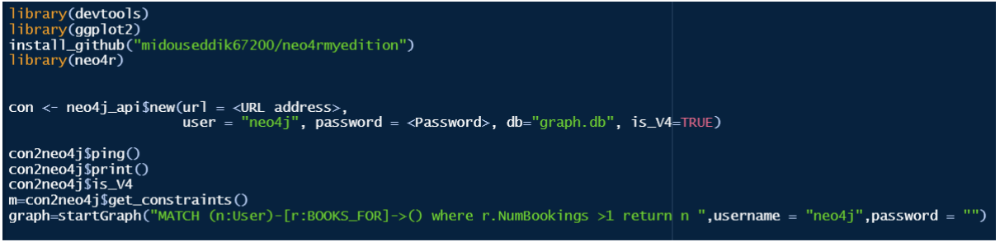
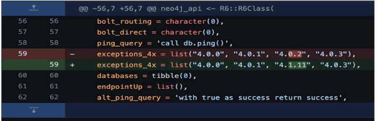
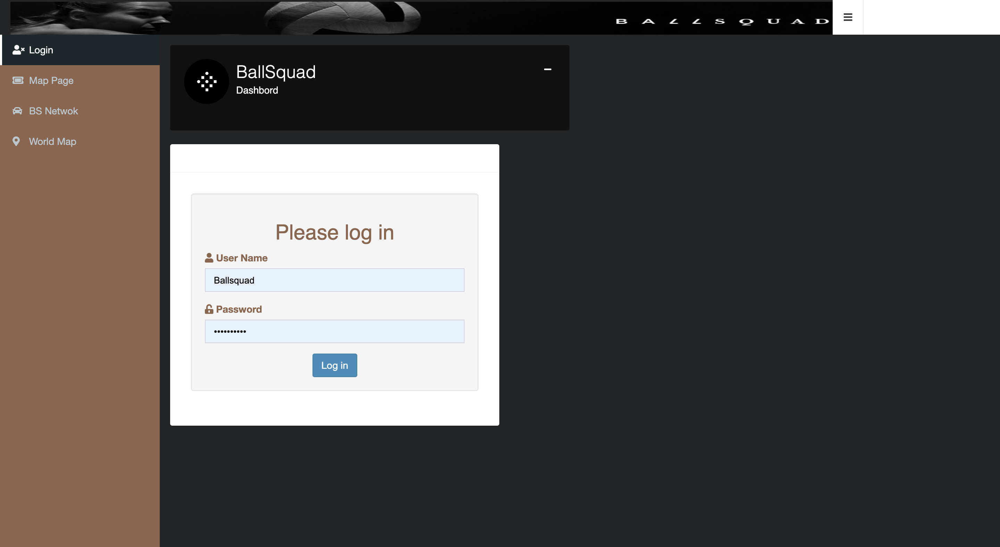

```{=tex}
\newpage 
\tableofcontents 
\listoffigures

\newpage  
 
```
# Introduction

The innovative system could be a solution to the urgent social and ecological problems of the fate of creative destruction could solve problems such as global climate change or the optimization of production and consumption speed. And the term ecosystem is increasingly a given in the innovative environment where ecosystems are a sequence or loop of collaboration between different actors in the lot where the interactions of these actors creates economic and social value and sometimes results in radical or even incremental innovation **(Ozgur Dedehayir and al. 2022)**[@dedehayir2022]. However, the ecosystem concept encourages companies to go beyond linear collaborations such as supply relationships, so that these linear relationships will not contribute to the broadening of the vision of the films, while companies are invited to discover and understand all the essential and non-essential entities in their business model in order to conclude or not the existence of an ecosystem structure in their environment. Focusing on the term existence and design, Ozgur Dedehayir et al. 2022[@dedehayir2022] concluded that the ecosystem is created through different phases where the first step starts with the research of the different actors in the ecosystem that can have an impact on the proposed value in order to pass the second phase that is summarized on the positioning of these actors in the system structure and also their possible accountable actions within the structure. Finally, the last step is the establishment of links between entities and actors in the ecosystem, in terms of role and influence. The interconnection between the actors in an innovative ecosystem is fundamental as the roles of the actors can be complementary or sustainable depending on the specificity of the ecosystem.  

This internship report covers a business model based on the concept of an ecosystem but also on the concept of the sharing economy. The sharing economy is a concept of collaborative consumption as we have noted before innovation can optimize the way and the pace of consumption and mainly this mode of innovation rubs up against the concept of sharing economy and sharing models such as Airbnb , second hand clothes and renovating firms. These famous sharing economy platforms do not use the same methodologies and resources as traditional platforms **(Jing Zeng 2022)**[@JingZeng2022]. Indeed, for these platforms the active product already exists in the sense that they do not need the resources and specialized skills for the design but need the collaborative spirit of individuals and the establishment of an ecosystem between these individuals in order to determine the role and influence of each entity. The challenge for these platforms is to manage the inexperience of some participants in the system and for this most platforms are equipped with a rating system that will monitor and stimulate the behavior of participants. The impact of this type of model on consumption is direct and effective **(Jing Zeng 2022)**[@JingZeng2022]. As consumers are attracted by the competitive price of the product offered, they will pay less than traditional products ("Uber vs Taxis", "AirBnB vs Hotel"), but also they will avoid the cost of maintenance and repair of some products and all other things equal.Obviously the impact on the pace of consumption changes from one business model to another and from one environment to another **(Xi Y. Leung A and Al. 2019**)[@XiYandAl2019]. 

In our case, the model is based on the digitization of public infrastructure to make the sharing of these facilities efficient and collaborative between the public and residents by creating a sustainable ecosystem. The digitization of public infrastructure and facilities is absolutely linked to the concept of smart city. **Didem et al. 2022**[@Didem2022] explain that this type of digitization is defined by the term digital twin. Digital twins is the term used when a physical object is virtualized and represented on a digital system by a twin that shares its information e.g. Facebook profile is a digital twin of physical persons. However, this term is first used by Michael Grieves in 2003 as **Didem et al. 2022**[@Didem2022] point out in their introduction. digital twins are the tool to monitor and collect massive data on the state of physical objects **(HAO ZHANG and al. 2017)**[@HAOZHANGandal2017] in our case are sports facilities in Poland and the rate of their use. So digitization of these facilities allows to collect of economic and social data about sports life in Poland in order to develop digital solutions that will help the firm to grow and also public authorities to understand the needs of the locals in terms of infrastructure and maintenance.

```{r twin, echo=FALSE, fig.cap="BS ecosystem Model , Source: HAO ZHANG and al. 2017 ", out.width = '60%' ,fig.align='center'}
   

```

The digitization architecture illustrated in Figure 1 is an example of the digitization phases of a bridge which is by definition a public good presented by Didem et al. 2022 . In order to have a digital clone of the physical object, one has to go through a chain of steps. Alas, the first step is to put in place hardware tools that transform physical information to digital data in a simple term they will be the senses of information capture such as a motion detector, camera, computer vision models and temperature sensors. The second and third step is to manage the data and information infrastructure by setting up a management and infrastructure model to store them in a database and then develop service applications such as APIs or data query applications.   

The projects presented in this report are purely digital environment projects as they will be involved in the last two stages: data processing, which consists of interacting with the data in order to develop statistical or predictive models, and the last stage, which includes the presentation and popularisation of the data displayed on dashboard. 

This report covers my professional experience with data about sports facilities and their users. Besides my adventure of exploring these data with statistical tools, programming languages like R and Python, and visualisation tools like Shiny and Neo4Dash. But also on the other hand a part of the infrastructure management with a project of data migration from a relational database to a network database. The objective is to understand the data and the business model in order to draw conclusions and make decisions on the management of the company and its various future changes.

\

# Business context

## BallSquad Business Model: Start-up of public infrastructures Digitization

BallSquad's business model is based on the digitization of public sports facilities such as stadiums, swimming pools and outdoor areas. These facilities could be located in schools or sports buildings. The aim of this digitization is to allow local citizens to use these places in a simple way by booking with a few clicks on their phone. "Why can we book a hostel or a restaurant in another country, but not a stadium in our city ?". **W. Barsali (CEO of BallSquad)**. 

The company has developed a web and telephone application (presented in the appendix) that allows court bookings and team set-ups for sports practices in which the users are free to book without having to deal with a usage contract as in a previous public system.  BallSquad is able to do promotion and commercial applications such as marketing and customer services for facilities that public administration cannot handle by definition. For monetization, the company takes a commission on the gross booking amount between 0% and 15%. The amount of commission depends on the school and the building administrator. 

BallSquad does not see itself as a service company but as an ecosystem in which it creates links between entities that are providers and users of sports facilities.However, the relationships with suppliers who manage facilities such as hygiene and maintenance are difficult because they do not take the risk of delivering the facilities because of the lack of users's discipline that can have an impact on the condition of the facility, especially as there is no contracts to control their a bad behaviors. For the time being, BallSquad prefers to negotiate with higher authorities in the city, such as the local community, to have the facilities in its booking system.

```{r pressure, echo=FALSE, fig.cap="BallSquad ecosystem Model, Source: BallSquad CEO", out.width = '60%' ,fig.align='center'}
   

```

Figure 2 shows the design of the Ballsquad ecosystem as presented by CEO Walid Barsali.However,the nodes in Figure 2 represent the actors in the system or, in more general terms, the actors that influence the ecosystem. The users node represents any kind of consumer of public infrastructure such as a partuclier or a school signing a sports facility, on the other hand the local administration represents any high level local or regional administrative entity such as the regional council, the mayor or even the prefect. Finally, the equipment entity represents those in charge of public facilities such as school, stadium or swimming pool managers. The influence of these actors in this system is presented by an arrow from one node to the other, i.e. a direct influence of the users on the higher administration to initiate a policy through their use behavior, and on the other hand, this policy forces the facility managers to make changes on a larger or smaller scale and these changes will have an impact on the perception of these users. Finally, BallSquad tries to cover the whole ecosystem by controlling each influence and, therefore, Ballsquad's intervention is represented by the wipes that leave BallSquad and enter the ecosystem. So, to achieve this influence, Ballsquad equips users with a booking application, and senior public authorities with a control of spending and viewing. And facility managers with software as a server to manage sports facilities.

BallSquad has three types of stakeholders in its ecosystem design. Stakeholders are the economic agents that can interact and have a direct impact on the business model as a user or a government and policy decisions. In our case, the stakeholders are the end-users who are the customers, the public administration which is the collaborator and finally the facilities responsible which are the suppliers.

In the ecosystem shown in Figure 2, we can see these three stakeholders. BallSquad has created this ecosystem to offer a smart solution to all these entities. For end users, the company offers an app and a website where they can book and use sports facilities. On the other hand, it offers a dashboard with an overview of the commercial information (presented on the appendix) of the facilities. This dashboards help the public administration to make a decision on the basis of the data visualization provided by the company.Finally, the facilities manager is getting Saas (software as service) to control bookings and assist facilities management. 

So, this first section summarizes the current business model of the company but the this model is under any future mutation where  we understand our opportunities and flexibility.  Especially, the social network between users and their applications with the power of big data technologies could be a future mutation in BallSquad model.

\

## Ballsquad teams and gateways between teams

BallSquad is a company with a specific culture, where every person on the team have its  importance from the CEO to the intern. Also, the average age in the start-up is no more than thirty. Furthermore, BallSquad has great faith in the talent of young people where the company's culture is based on freedom and flexibility of work where the employee is free to work remotely and choice the methodology that  can make them feel comfortable with their tasks.

```{r team, echo=FALSE, fig.cap="BallSquad teams Organization , Source: Author ", out.width = '66%' ,fig.align='center'}
   

```

 As shown in Figure 3 The company has four teams, each team has a specific leader, consisting of the three founders and the marketing director. The founders have a complementary profile. Walid is a specialist in economics and management, Dorota is a specialist in public affairs and law. And Dmitry is a specialist in software development and database management then Marek is a marketing director who manages the marketing dimension of the company.

Thus, each member of the executive team manages a part of the company business dedicated to these skills in addition to the team that helps him/her in the different tasks.

First of all, the most important team in the company is the development team that is constituted of mobile and web developers and data engineers who ensure the architecture of the software and the flow of data into it. 

The second team is the business intelligence team, which consists of an economist and data scientists, and is responsible for dealing with business issues in general with a positive approach as well as  the collection and processing of internal and external data. 

So far so good ,customer success team led by Dorota, who is in charge of customers who might have problems with the booking system and the last team in the firm is marketing team that  deals with digital marketing concepts such as social media, Google maps and customer targeting. 

Moreover, the teams in the organization cannot carry out a project without the cooperation with the other teams because a good project covers many dimensions and aspects of the ecosystem.

The cooperation between teams in the start-up is efficient and flexible by definition. In the case of BallSquad, cooperation is achieved through meetings during the week, communication tools and software such as Google services "Drive, Meet, Gmail" and also Slack which are cooperation and communication software. As well, reporting remains one of the most useful tools for collaboration between business units for example, the marketing team explains its needs to the BI team by writing a report on the problem then BI team will try to understand the problem and provide BI solutions such as dashboards, machine learning models or causal models. In the same way, cooperation can take place between other teams.

\

## Ballsquad BI team

Business intelligence refers to the set of computer or strategic techniques that aim to collect, analyze, and process data of a commercial or informational nature that will have an impact on the business. 

Business intelligence has advanced considerably with the advent of data management techniques where the focus of this discipline is on three pillars **(Rafi Ahmad Khan 2012)**[@Khan2012] which are data collection and capture, data storage and data access and analysis. 

The importance of BI stems from the importance of information from a purely strategic and rational point of view, as can be seen in the field of game theory, where a single informational detail can change the strategy of a player. Today, organisations are placing more and more importance on the BI department, as it allows them to acquire information in order to make it useful with reports or dashboards.In the context of BallSquad, the BI team seeks to cover all the information and metrics that could impact the ecosystem and business model through computational and statistical techniques in order to expose the results in visualization graphs or reports that can be read and used as an aid to decision making both internally and externally by the public administration The CEO of the company advises the BI team to find out about the business status of the company but also about the evolution of the transaction or the number of active users.

In the BallSquad structure, business intelligence is an important entity where BI tools simplify the work  and data understanding. These tools typically work with data to fit the problem solution for example, the BI team plans to develop a dashboard that summarizes all customer information by selecting the customer email or ID where this tool can help the customer success team to cooperate effectively with customers. In addition, the BI team is cooperating with the development team on a machine learning project where the discussion is about the potential implementation of this model in the product and how the model can help to improve the business value of the start-up.   

In general, the BI team works on three main tasks to check the relationship between the data sets and whether all the logical relationships are valid by a good calculation as example, there is a transaction data set and a commercial data set where the commercial data set summarizes the business information of the facilities from the transaction data set. Unfortunately,  there is a computational error problem between these two data sets, and the BI team is working to find out where the root of this computational error lies. 

The second task of the BI team is to build KPI dashboards for the CEO, which summarize the growth and amount of revenues and costs in many dimensions as well as  the team builds dashboards for public administrations that summarize sports life in a given city or district. The tool used for these dashboards is Microsoft Power BI that allows us to import static data from Excel or CSV or from relational databases such as MySQL.

Moreover, the BI team is responsible for collecting data from different resources such as socio-demographic data on Poland and facilities that are outside the BallSquad system where this kind of data allows us to understand many mechanisms such as user behavior  market penetration or network effects.

In BallSquad, the main data is collected through the interaction between users and the product. As well, the back end of the application is an SQL database that contains data on user behavior in terms of transactions and interaction with the sportive installations.

The data scientist does not have direct access to the main database as queries can have a direct impact on the system performance. In any case, few people in the company have the  access to the operational SQL database . Thus, the data scientist must request data in CSV format from API services that are equipped with query parameters such as time range or entity ID. So ,a data scientist at BallSquad must be a friend to API tools to perform different tasks and projects.

### API services in Ballsquad system

According to Reddy M., an application programming interface (API) "is a way for two or more computer programs to communicate with each other. It is a type of software interface that provides a service to other software.

In our case, these applications store interactions within the BallSquad system and entities on structural databases with a "POST" command, whose purpose is to create a resource. In this way, the various APIs make the system flexible and able to store and use data from SQL databases.   

For example, if a user books a court, they request an API and that API requests another API which checks the availability of the court from the database. And if the booking is confirmed by the availability of the court, the booking information will be stored in the database by other applications in the system. 

In order to optimize the requests in the system and to improve the user experience with the application, the user interface shows customers the availability of courts before they book. To do this, the server uses the same API to check the information in the database. Once the response is approved, the booking will be stored in the database as an interaction between the user and the court in the transaction dataset. In addition to real-time interactions, there is an API that stores new user profiles, new facilities, new districts, and new cities in the SQL database as these new entities are integrated.  

The data scientist uses this API to create automation for the dashboard as well as to create a migration to allow entities to use this API. The data scientist has access to the administration's website which provides the query and documentation on the use of this data resource. 

\

\

```{r BS API, echo=FALSE, fig.cap="API Documentation Page , Source: BallSquas Admin Panel", out.width = '66%' ,fig.align='center'}
    

```

### Daily and project data scientist

BallSquad relies on the power of individual responsibility where the worker does not need to ask or explain their movements or steps in the work. The data scientist at BallSquad is free in it working methodology and also with  the tools that he use in daily work. Generally, the tools were Python, SQL and Power BI.   

But when I arrived, I introduced new tools to the company, such as RStudio, Shiny and Neo4j as a new graph database. I also developed an ETL application for migrating from a SQL database to a NoSQL database. 

BallSquad checks the progress of tasks and challenges through various meetings during the week. These include a progress review, where the team presents tasks, progress and challenges, and a meeting on the last day of the week with the whole team to discuss all dimensions of the activity and what we have achieved during the week. 

The regular journey at BallSquad starts at half past nine. We set the day's objective for each team, such as fixing bugs or importing and cleaning data. We start work in a collaborative environment where we can communicate between and within teams. In addition, direct contact with the CEO . The day can be charged with a lot of work or it can also be a relaxing working day; that depends on the ongoing project and the tools that we use. Generally, data scientists at BallSquad are charged to build different visualization tools for other teams and also for public administration. For public administration, we deliver dashboards developed under Power BI and for these types of dashboards. After all, the company wants to develop other internal dashboards with other tools which are open source such as **R-Shiny** and **Neo4dash** but the problem is that the APIs that we use make our system in a difficult situation due to the performance. The API is also used for the good conduct of the main application. 

As a data scientist, I worked to write Python code which optimized the uses of these APIs and also proposed to the team to build a new database. The database that I asked the team to build will be a mirror database of the principal SQL database that the BI team can use to build a different automated tool such as dashboards or machine learning models and this database can also be the pre-production environment for the machine learning model testing. This mirror database will be NoSQL and based on Neo4j for economic and technical reasons that will be discussed in the next section. The internal dashboard will be based on R and R-Shiny, a tool which allows the development of the backend with data management and analysis. And on the frontend we customize R-Shiny with HTML to manage the color and the markup of the dashboard. Generally, the tools which are used in the internship are Neo4j and ETL Application for migration from SQL to NoSQL. For the  development of R, Shiny and Neo4dash we use packages such as visnetwork and leaflet. For sharing and deploying, we host the dashboard in the cloud that the Shiny website provides. Finally, Ballsquad wants to be the standard of the sports facilities bookings and this project helped to develop a tool which allows seeing the market penetration and target facilities and users.

\

\

```{r TOOLSP, echo=FALSE, fig.cap="Tools Used : Neo4j , Shiny , ETl , Source: Author", out.width = '66%' ,fig.align='center'}
    

```

# Internship project  

\
\

## General presentation of the project

\
The project architecture is divided into two main parts. the first part is a data migration task where we move data from the storage structure to another one by performing some tools and applications. the second part is about developing web application which display data from a new data storage solution into visualization tools such as Power BI, Dash or Shiny. 

As noticed, the first part is about **Data Migration** from our SQL database to a network database. So, in this task, we develop an ETL  python application which extracts the data from the MySQL database and transforms it into graph format with Pandas before storing it in the Neo4j Graph database to achieve this task we need a connection between all these entities. Finally, the company will then adopt the graph database as a business intelligence resource to store and retrieve network data.

The second part of the project is about developing a **dashboard** that allows us to get an overview of users and future predictions about behaviors in terms of reservations and interactions with other users. In addition, the dashboard presents the company's initiative to adopt open source tools such as the Shiny or Django frameworks.

Shiny is the framework chosen to develop a web application that will be our visualization solution and it is based on the programming language R and Neo4j in the backend. Also, the front can be customized with markup languages, like HTML and CSS, for advanced visualization. JavaScript can be a solution for the interactivity between website elements.

In this report, Shiny is the visualization tool used for networks and also for geographical tools. It can be a perfect tool with networks, to have information about penetration rate on the market and discover the state of standardization of our product on the market. What is more, we also develop visualization reports for public administration. These reports are simple and understandable even for someone who has no experience in data-driven decision-making.  

Generally, the project is based on the graph database which is useful to visualize the network structure and moreover is an open source software. The implementation of the Project used many tools and applications. For the storage, we used Neo4j as well as Amazon Web Services. In the dimension of structure of the network, we used Python to build an ETL application which migrates data from MySQL to Neo4j. 

A migration strategy can solve the big data storage moving problem. In the end, we use Power BI and Shiny to give a business and commercial view on BallSquad networks. The global architecture of this project is presented in the figure below.

\
\

```{r project_archi, echo=FALSE, fig.cap="The project architecture , Source: BI Team Collaboration", out.width = '66%' ,fig.align='center'}
  

```

## Economic motivations for the project

In the literature, the concept of network analysis is increasingly evident. Especially thanks to the development of the Internet and IoT, most of the new business models are now based on the network shape of a system or multi-systems. As well, The motivations of this project are based on three factors which are the trends of the network analysis and big data technologies **(Adhe Rizky and al., 2022)**[@Adhe2022] **,**Machine Learning Applications on networks and the network effects and Product standardization **(Jae-Yun Ho and Eoin O'Sullivan, 2017)**[@Sullivan2017].

The main power of the networks is their effect which is called network externality. In plain terms, network externalities are the positive impact on the product value when it is used by several customers, e.g., the utility of the phone increases when the number of users increases and the utility value of the phone depends on the number of customers using it. However, the literature divided these externalities into two effects: direct and indirect **(Yinghuan Wanga and al. 2022)**[@wang2022does]. The direct effect exists when the utility of the product increases with the number of users, like in the case of social media, bars, clubs. And, the indirect effect is when the demand or use of a product increases the demand or the value of other products. **( Katz et Shapiro, 1986)**[@Katz1986]  

The key in an advanced business model is the strategic value of the networks into it **(Darek M. Haftor and al., 2021)**[@Darek2021]**.** Generally, the business's networks can take several dimensions such as a time range, geo-demographic and social. In certain cases, the network can be between different actors and entities, for example the network between a product and customers where the gravity is focused on the utility of a product. In the **eBay** [@eBay] business model case, the network between buyers and sellers is made by the product on itself. 

In addition, the network can be also between users, as a long-term relationship between seller and buyers, which is an effect that can be an alternative to the main market. **(Williamson, 1979**)[@Williamson1979]. 

Network analysis can be applied to different fields in the company structure **(Adhe Rizky and al., 2022)**[@Adhe2022], such as project management, customer success, as well as marketing. In the long run, machine learning and big data technologies will give network analysis a predictive side where the volume of data allows one to understand as much as possible the behaviors of the network, in order to perform a predictive model.

### Overview of Network Analysis Methods & Implementation Fields

```{r evo_network, echo=FALSE, fig.cap="The Evolution of Network Analysis research , Source: Adhe Rizky and al., 2022", out.width = '66%' ,fig.align='center'}
   
```

Network analysis is increasingly useful for different fields of economics, computer science, tourism, psychology and management **(Adhe Rizky and al., 2022)**[@Adhe2022]. This tool makes decisions more effective with less risk, moreover, the number of publications that deal with network analysis was 2158 publications in 2020. we can conceive the trends of publication in three main periods first part from 2001 to 2009 this period the number of publications increased but the number of citations per article decreased more significantly than the increase of publications where the network analysis was a trend between a community and it was not a general trend as it is shown in figure 7. 

In the second period between 2010 and 2014, the publications of network analysis followed an unstable trend where the number of publications per year remained between 60 and 80 articles per year. At the same time, it was more important than the number of publications in the first period.

In the last period between 2015 and 2020, network analysis is experiencing an exponential increase as shown in figure 7 from 60 in 2015 publications per year to 160 publications per year in 2020. and this increase is more significant than the decrease in citation per article and this shows that network analysis is becoming more and more a global trend in different fields of science this trend can be explained by the development of new tools for modeling and processing social networks such as machine learning methods and big data technologies.In addition to software specialized for storing and processing network data since 2015. 

Generally, the trend of publication has turned upward since 2005. Most areas that use network analysis according to the statistical analysis by **(Adhe Rizky and al., 2022)**[@Adhe2022] are project and risk management, these two areas are strongly related in the way of conducting a project also manage the risks related to, the first article that incorporates network analysis in project management are Loosemore (1997) which deals with the effectiveness of communication in engineering projects. 

The most cited article in this field is Pryke (2004) which deals with networks between different levels of the company, unlike Loosemore which based the network analysis at the individual level. Adhe Rizky and All showed that project management uses network analysis in planning, accident prevention and communication. 

Furthermore, network analysis is also used in innovation and knowledge management where this tool illustrates the roots of publications and patents, and the relationship between fundamental and applied research can be captured. Indeed, these methods assist regional and national policies to be more effective in knowledge externalities optimization.

Finally, network analysis is used in different fields of science and management such as biomedicine, psychology, history and supply chain management where the strength of network analysis is its ability to illustrate the different relationships between entities, and the development of machine learning and modeling methods has reversed the trend in favor of network analysis fields.  

The statistical method of modeling networks is divided into two areas: descriptive methods and predictive methods. Descriptive methods include a matrix of a network that resumes all possible links between entities and their importance as well as statistical properties of networks like centralities, transitivity and betweenness. 

Predictive methods are varied, such as clustering methods of social networks which is an approach that detects communities in networks to create sub-networks within communities, "Community search and clustering methods are among the most common tasks in network analysis and are generally concerned with partitioning networks into highly connected subgraphs" **(Salter-Townshend et al. 2012)**[@Salter2012]. 

Machine learning modeling methods are capturing most of the trend through big data and internet of things "IoT" technologies where the behaviors can be saved and processed **(Md Arafatur Rahman et al. 2021)**[@rahim2021]. 

\

### Machine Learning Applications on Networks

**Link and Path Detection**

\
Nowadays, link or relationship prediction has become an obvious method in the analysis of networks for finding wrong and potential links, and the prediction covers many types of links in social network friendship, working and teaching relations. Indeed, link forecasting in social networks is about detecting the contact between two individuals **(Feipeng Guo and al 2022)**[@guo2022path]. However, the link prediction is submitted to statistical learning methods such as supervised learning and deep learning where the algorithm learns a network and the relationships within it to identify potential relations where it refers to the nature of the relationships and individuals that already exist **Xin Li and al. 2022**[@Xinli2022survey]

The paper "A survey on QoT prediction using machine learning in optical networks" by Xin Li and al., shows the implementation of machine learning in optical networks which are different from classic social networks but the way of implementation is the same at the limit where **Xin Li and al**[@Xinli2022survey]

train the model with algebra analysis. The authors essentialize the different machine learning applications for links and path forecasting as well as reinforcement learning. At the same time, **Zhiquan Cui and al 2022**[@Zhiquan]  use a deep learning algorithm for forecasting the Gas path. These applications of network analysis in optical or gas paths generally are identical to applications in the case of social networks where the algorithm and methods are the same and the differences are the characters of nodes and the relationship between them.  For link predictions in social networks, **Feipeng Guo and al**[@guo2022path] put on the table many approaches, Where the first is a similarity approach which is based on local information and node similarity such as the relationship is more probable between similar nodes than dissimilar nodes. The second approaches are path-based predictive indices and this method is based on probability and maximization of likelihood function until the optimum where optimal maximization of likelihood function generates a potential future edge between nodes.  And the third method that authors suppose is machine learning where they specify two approaches classification and matrix factorization. Classification approach in machine learning responds to the problem of whether there is a potential relationship or not by learning existence information in the network as it is mentioned before. the matrix factorization approach where we decompose the original matrix into a sub-matrix that crosses implicit and explicit information with non-negative value and this decomposition flow updating parameter process can be optimized to improve the accuracy of the method.  As mentioned the link analysis and forecasting it's about contact between individuals and that is what drove **Daniel and Xu 2021**[@xu2021modeling] to build a model of tracing covid network where the model detects the contact between the persons and also the level of this concat where the high-level contact detected with a contaminated person require a  quarantine. where he uses simulated data of networks but with a large bag of parameters about contact, the temporal dimension of contamination and the links dynamics . The general view of link and path predictions leads to a conclusion that this method of network analysis is so varied and has a large strength to detect and resume the future network dynamic.

**Community Detection**

\
Although there is no single definition of community, the most distinguishing feature of communities is that they have a high number of connections among themselves while having a low number of connections with outsiders (Figure 8 ). Many application-oriented community definitions can be derived from this basic feature itself. People are familiar with networks, even if they are unaware of them. You might be using social media sites like LinkedIn, Facebook, or Reddit; these are social networks. You may be dealing with the cryptocurrency market, purchasing new coins, selling what you have, and so on. These, too, are examples of networks.

\
Networks exist not only in the field of technology, but also in people's daily lives, and people go about their daily lives while connected to a variety of networks. Communities are features of many networks in which nodes within a community are highly connected, and where a given network may have more than one community. Multiple nodes in the community may be a conflict. Consider social media platforms, such as Facebook, and the people you interact with on a daily basis. You may have a close relationship with your family, colleagues, or circle of friends. The social networks of people form a complex community. To distinguish and better understand these communities, various methods can be used. The Community detection method is one of them. 

```{r evo_network_com, echo=FALSE, fig.cap="Community Detection in Graphs , Source: BI Team Collaboration", out.width = '45%' ,fig.align='center'}
  
```

Discovering the communities within different networks can be an important step when analyzing them. Community detection techniques can help social media algorithms find people who share common interests and keep them connected. As said before, community detection in machine learning can be used to detect groups with similar characteristics and to distinguish groups for a variety of reasons. This method can be used to investigate manipulative groups in a social network or the stock market. In the field of community identification, numerous techniques have been proposed. The following sections describe four popular community detection algorithms.(**Giulia Contu, Luca Frigau & Maurizio Romano, 2019)**[@Giulia2019]

Complex networks based on graph theory are now commonly used to comprehend and analyze large amounts of data. When the above-mentioned stock market example is examined in-depth, it becomes clear that analyzing and managing a structure with constantly changing and fluctuating big data, such as the stock market, is difficult for investors and company executives. In these studies, complex networks and community detection techniques are useful. Following the creation of the stock return correlation network on the Tehran, Iran stock market, the share of the same group was analyzed using community detection to determine whether sub-industry stocks were grouped or whether a company was in a group. **(Farideh, Mohammad & S.Kamal, 2020)**[@rahimnezhad2020] A shareholder of the same company is placed in that group instead of that company, regardless of its industry. As a result, it is reasonable to conclude that the correlation between the stock prices of companies is largely determined by the industry in which they operate. It can be seen that the industry's correlation computation and the algorithm's ensemble generation based on Louvain modularity optimization acted logically and scientifically. Large-scale aggregation reduces the cost and energy required to further separate each community or to analyze, monitor, and manage the entire community at a higher level with less detail, while also streamlining and speeding up the macro data analysis process.

**Recommendation System**

A recommendation system or system of information filtering is one of the most known machine learning algorithms which are applied to network analysis. The recommender is an algorithm that collects the information about items like preferences, gender, language, location and relationships in order to make future behavior predictions." Recommender systems work based on users' information from different sources and provide recommendations of items. **(Murale and Aswani 2016)**[@Murale2016]**.** The application accuracy of recommendation systems can vary from one network to another and this depends on the type of items in the network and the type of network itself. The best-recommended application in terms of performance and credibility is a location-based social network (LBSN). A local based social network is a classic or small world network but with geographical data of nodes. Generally, the recent literature focuses on this type of network for recommendation systems for example **Yuhe Zhou, Guangfei Yang, al 2022**.[@Guangfei] Where the authors deal with recommender application on LBSN  and they specify the relationship between geographical location and behaviors \`\`Location is one of the important components of user context and implies extensive knowledge about a user's interests and behavior, thereby providing us with opportunities to better understand users in an abstract structure not only according to user behavior but the mobility of the user and his/her activities in the physical world". **(Yuhe Zhou, Guangfei Yang et al., 2022)** [@Guangfei] On the other side **(Lei Chen at al., 2022)**[@chen2022multi] develop another specific graph for tourism network system recommendation. Where multi view graphs can present many types of nodes and edges. the nodes can be preferences, users, products or locations and the edges can represent users, products, travels and places relationships as shown in the graph schema.   

The basic algorithm of recommendations is a filtering algorithm that is based on the similarity and dissimilarity between items in their main character or behaviors such as **J. Bobadilla and al 2013** [@bobadilla2013recommender] from Madrid university describe recommendation systems as a filtering algorithm based on different types of filtering which can be used separately or crossed. The main filters in a recommendation system are Content-based filtering, Collaborative filtering and Demographic filtering. Content-based filtering is a method based on the past behaviors and preferences of users as long as demographic filtering is based on the character of the user (age, gender, income, personality...). Finally, Collaborative filtering is a collaborative spell between the user and the system where the user gives feedback about his experience and exposes these preferences explicitly to the system.  

The algorithm deployed to develop recommendation systems is similar algorithms that capture similarities between users at the same time similarity between products in order to offer the same product to similar users and provide similar products to users where the system predicts the user steps and behaviors facing similar products. The k-neighbors algorithm is one of the references for RS "The k Nearest Neighbors (KNN) recommendation algorithm is the reference algorithm for the collaborative filtering recommendation Process."**(J. Bobadilla and 2013)**[@bobadilla2013recommender]. Where this algorithm is simple for implementation and manipulation where we define the number of neighbors to take similarity into account in order to define top n-recommendations. Finally, the recommendation systems are improving in terms of flexibility and accuracy with the arrival of digitalisation and smart city concepts at the same time with a deep learning approach. **(Yuhe and al 2022)**[@Guangfei] where Yuhe and al make points on the new deep learning approach based on location data such as examples represented in the framework. (Figure 9)

```{r evo_network_frame, echo=FALSE, fig.cap=" Recommendation System application on LBSN Framework, Source: Yuhe Zhu, Guang Fei Yang, al 2022", out.width = '66%' ,fig.align='center'}
  
```

### Network effects and product standardization

 In the economy,  the market plays a crucial role to define the standard product and platforms where the market is under several factors such as the competition ,consumer characteristics and laws imposed by the authorities. As well, Standard is the market's choice of reference to a product where the market imposes the standard as the leading product or platform for example, Google is the standard search engine that the market, by definition, tends toward too and, at the same time, this trend further enhances Google's position as the standard. Saint Matthew effect "the rich get richer and the poor get poorer".Therefore, standardization becomes the absolute goal of any innovative company whose innovation will be a standard in the existing market **(creative destruction)**[@creative] or in a new market (**Blue ocean stratgy)**[@blue]. 

Network effects are a key framework for standardization and diffusion of innovation **( Bahrami and All 2019)**[@bahrami2019], These effects have an impact on innovation in terms of diffusion, as product information can be disseminated through networks as well as the efficiency of knowledge diffusion increases the number of users with the number of a new customer is a linear function of the number of previous users **(Bahrami and All 2019)**[@bahrami2019].

Under this assumption, we rely upon standardization and diffusion of innovation with a network effect. At the time, network effects impact diffusion by simplifying several mechanisms such as the cost of information in the market where the customer and suppliers will obtain information about the product and its performance **(Ho and O'Sullivan, 2017)**[@Sullivan2017] , and the flow of information will naturally decrease transaction costs. And under these conditions created by network effects. The product's market penetration accelerates in terms of time **(Tassey, 2017)**[@tassey2017roles] and with lower marketing and operating costs.  

However, the diffusion does not occur almost naturally on the network and that depends the field of business and  the network characteristics  **(Van den Ende et al, 2012)**[@van2012paradox] .As well, the type of network plays a key role in product dissemination, e.g. if the network is well focused  on an entity, dissemination will be easier if this entity is reached by diffusion process as example, collaboration between companies and influencers and/or footballers for marketing campaigns. So at this stage, the second hypothesis is that the more the network is centered, the more the standardization process will be faster , Because a random or less targeted network may suffer a loss of information in addition to a loss of  efficiency in the diffusion, as a badly positioned entities may cause a braking effect where this effect trains to higher transaction costs and slower market penetration. The importance of understanding the network and its contours becomes increasingly evident as the process of standardization and dissemination develops. 

### Networks In BallSquad context

Thus, in this section we will explain how the motivations described in the previous section can be related to our context. First of all, it is necessary to understand the company's big data project, which is not presented in its entirety in this report, because during this period the machine learning models have not yet been implemented. The big data project consists of trying to collect data about facilities outside our system, such as name, type, geographical coordinates and availability, as presented in the attached web scraping project.

So the first step of the project is to understand the network effect between the installations outside our system and the installations in our system because the cost of information reduced by the network effect will incite the installations to join our system or this effect is not sufficient so for that we will develop an algorithm of community detection by entering them on the internal data to detect a community (users-court). In fact, the community is a group of users who will use the same group of facilities. Then we will apply this model on external installation data to detect if installers have the potential to be in a short user community but also in which community, a successful community from a business point of view or a poorly performing community in order to develop a visualization tool for the marketing department and the public affairs department to define an acquisition strategy that could boost the growth of the strat-up. 

And to detect the potential of an installation outside the system by a case by case treatment, we will apply a link and path detection algorithm where we can predict the number and the profile of potential users of the installation. However, the applications of community detection or link path detection will remain perfectly sustainable in our context and will also lead to the same end that is the prediction of the installations with a great potential of profit for the firm. So for the implementation of these algorithms it is necessary to understand and cover all the aspect linked to a network as the effect or a good measure of this effect with economic models to help the data scientist in the task of feature engrening where he will understand the mechanism that could influence the potential of a facility but also the motivation of these responsible to join our system.not only could community detection or link detection be applied on the network but also a recommendation system which is qualified as a mix of these two methods. A recommendation system is an advanced technique to connect our customers with external installations of our system in order to motivate the managers of these installations to join our system by the arrival of new customers.So, these techniques and this project are there in order to standardize our product where the network externalities will participate again but not in a user-court network but in a court-court network.However, standardization will impact on the pace of marketing and acquisition of companies through the mechanism of more large-scale installations and market penetration, resulting in more power and a monopoly position on the market for the use of sports facilities. This monopoly position will lead to a concentration of customers on our products through network externalities and this concentration will result in a lack of customers in facilities outside of our system which will automatically lead to a decrease in the rate of marketing and acquisition as our position in the market increases in order to save time and energy in this department.

\

## Migration Project : Neo4j BallSquad Graph solution

 

BallSquad's original data structure is a SQL-based relational database. This database can also capture various real-time updates to the databases, such as a new transaction or a rolled-back transaction. The project in this report deals with the process from user interaction with the applications in real-time to the visualization of the network in the BI software. The Ball Squad network is not about user-to-user interactions but about user-to-sports pitch networks. The network should be summarizing the usage relationships where it shows the preferences of the users and on the other side the users of the yard and the tension of their usage. In this case, the conflict is the network's data are NOSQL and BallSquad's databases are implemented on relational databases.

However, the transformation of relational databases into a network structure is possible and this process is called conversation or structural transformation. The difference between the relational database and the graph database lies in the importance that graph databases give to the links between entities, while in relational databases this dimension explains the lower importance.  The graph data structures consist of two main elements: the node list and the link list. Node lists contain information about nodes such as labels, position and many node characters. This list can be represented by many orders of data frames to describe and store many types of nodes. The second element is the edge lists where we store the relationships between nodes and these relationships can be represented by several edge lists for each relationship type. 

The migration from relational databases to graphical databases follows key steps. The first step is to understand your original database infrastructure and the different relationships between elements. For example, in one part of BallSquad's relational database infrastructure, there is a non-direct relationship between the user dataset and the court dataset, but the relationships are established by a transaction dataset. For example, the transaction dataset's user ID and court ID are foreign keys. The second step is to transform the infrastructure into a graph database infrastructure. In this case, the transformation starts by removing all transaction data and foreign keys and replaces them with relationships between users and courts, these relationships having properties that contain information such as, in this case, information about a number of uses and also a time dimension of the use, such as the duration and date of the last use.

Finally, the transaction data will be replaced by an edge list data set that summarizes information about the relationship between the user and the court. At the same time, the user and court data structure sets will be a list of nodes that contain information about users and courts.

 

```{r esql_nosql, echo=FALSE, fig.cap="Relational database versus graph database, Source: BI Team Collaboration ", out.width = '66%' ,fig.align='center'}
  
```

The graph database structure is based on nodes and edge information as it's repeated on Figure 10 where blue nodes are users and reds are court entities. And the third component is the relationship between the user and courts that he uses as a part of the graph database represented in Figure 10. 

Nowadays, the platforms or software that can store graph databases are Neo4j, JanusGraph and Titan. The Neo4j is a storage software solution for BallSquad graph databases because it is open-source software and can support billions of entities and relationships.Furthermore, big companies like eBay whose business model is based on network externalities, adopted Neo4j as a solution "Our Neo4j solution is literally thousands of times faster than the prior MySQL solution, with queries that require 10-100 times less code. At the same time, Neo4j allowed us to add functionality that was previously not possible." **Volker Pacher, eBay**. So, Neo4j is a solution offering high flexibility and fast queries, as well as convenient visualization of networks, which can be exported and used in visualization tools such as Power Bi, Tableau or website dashboards.  

The comparison between Neo4j and Mysql seems evident at this stage in order to avoid any question related to the performance or the usefulness of this operation of migration. Indeed, the cost of acquisition of these two software is identical such as both are open source software developed by private company Oracle developed MySQL and Neo developed Neo4j protected by a GNU GPL licence thus in term of costs both licence are free and open source. But from a performance point of view **(Chad Vicknair et al.  2010)** [@vicknair2010comparison] concluded in their investigation of the performance of Neo4j versus Mysql that Mysql performs better on general database configuration and on write and update operations but Neo4j performs better on read data queries. As our second part of the project uses data visualization, we will need a more efficient query reading system to make the interaction between the client and the dashboard more flexible and optimal for the user.So, Neo4j become an optimal solution database back-end of the dashboard. Speaking of flexibility, network databases are more flexible than relational databases because they are not constrained by a fixed schema, while relational databases are subject to a fixed schema before data is inserted **(Chad Vicknair et al. 2010)**[@vicknair2010comparison], which is not flexible with structural changes over time. However, graphical databases such as Neo4j do not need to be restructured when adding new relationships to data.In addition, in the context of a start-up that is constantly evolving and changing on the basis of the "start-up is flexible by definition" , the Neo4j database is the solution to adapt almost automatically to a structural change of the data.Furthermore, **Nenad Petrović (2021)** [@petrovic2021] in his paper "Booking Cancellation Prediction Relying on Graph Database in Neo4j" performed booking cancellation predictions directly on Neo4j without using programming languages such as python and R. Neo4j is equipped with a machine learning and statistical library called Graph Data Science (GDS). For example, Nenad used the command "gds.alpha.ml.nodeClassification.train" to implement its model on Neo4j.In my opinion, it is revolutionary to implement models directly in the data infrastructure because it avoids developing APIs and architectures to implement the model in the product. In general, Mysql is more mature and secure than Neo4j, but Neo4j is more flexible and more powerful in reading data, but also equipped with data science support and for all these reasons we adopt Neo4j as an alternative data storage solution.

\

### Project Data Structure

**Source Relational Data base**

The portion of the BallSquad's SQL database that will be migrated is made of seven different datasets.

The city, district, facility, and court datasets collect data about IDs and business information.

In particular, the data listed are:

-   For the city dataset: city ID, latitude, longitude, name of the city, etc.,

-   For the district dataset: district ID, name of the district, etc.,

-   For the facility dataset: facility ID, latitude, longitude, name of the facility, postal code, status, street address, etc.

-   For the court dataset: closing time, court gross hourly rate, default hourly rate, ID, maximum booking limit, name of the court, opening time, etc.

Moreover, there are commercial and transaction datasets. They collect, respectively, information from transactions (generally collected at the moment of booking) and commercial information about entities registered in the BallSquad system.

\

\

```{r evo_sql_strctur, echo=FALSE, fig.cap="Schematic representation of the portion of the SQL database to be migrated , Source: Author", out.width = '66%' ,fig.align='center'}
  
```

\newpage

**Expected Neo4j Graph database**

Neo4j is a NoSQL database that we use and migrate data to.In our case, there are five different types of nodes, and each type requires a node list which illustrates all the properties and labels of that node. In this section we will explain the structure of this lists, and the datasets which will be needed: 

-   Users Nodes: These nodes require user ID and much business information about the user such as total booking made by the user, total expenses of the user within the BallSquad system, home address and email address. The user dataset and transactions dataset are needed to build these node lists. 

-   Court Nodes: require the court IDs and usage information like the number of reservations made for the court.

-   Facility Nodes: require stadium IDs and other information. We use the stadium datasets and transaction data to make this list. 

-   District Nodes: require district IDs. We use the district datasets and transaction data to make this list. 

-   City Nodes: require city IDs and other information about cities, such as number of bookings, sold hours, number of discounts applied. The city dataset and transaction data are needed. 

\

As mentioned, in our Neo4j structure user nodes, court nodes, facility nodes, district nodes and city nodes appear and for each kind of entity we need to create a label with a corresponding ID. It is important to underline that, within the same kind of entities, IDs are unique. Hence, for example, no user nodes with the same ID can be found and also to be sure to not store duplicate data.

Different relationships between these nodes can be found. In particular, the relationships are \<user> "books for" \<court>, \<court> "belongs to" \<facility>, \<facility> "located at" \<district> and \<district> "in" \<city>.

\

### ETL Python Application development steps

Data migration is the process of recolonization of data from one structure to another. In our case the migration will be from relational database structure to graph database where the data will be stored as a network format. The migration of data follows a defined protocol with steps and stages. And these steps can be flexible or structured, depending on the structure of the source and the target system . BallSquad has chosen Neo4j as a graph storage engine. The source structure is a SQL database in the cloud server and the target is Neo4j in Amazon Web Services.  

After defining the pipeline between SQL and NoSQL databases via Python and APIs, the process needs some functions in Python which import data via API from the source and transform it to data frame.

On the other side, we build functions to clean and transform data to the list of nodes or to the list of edges before storing this data in Neo4j with Python, which will then communicate this data in Cypher language. We recall that Cypher is the query language in Neo4j.  

After defining these functions, we define the APIs which will be used in the migration. As mentioned, the migration process does not concern all entities in the current system but just entities that can help to extract business information and develop machine learning models. The entities that will be migrated are represented in the  figure 11.

The level of this task is an **advanced level**, because to perform the application and move a data from a structure to an other we need to be sure about several aspects on the process such as neo4j database hostage on AWS as well as the connections between  Neo4j and the API. In addition, follow a migration path that will not impact the performance of the source system. However, the task was divided among the team members where Levent was responsible about the hostage of Neo4j on the cloud and devlopment of management feature such as functions which made queries into APIs and others functions which connect to Neo4j server. In addition, The co-worker Arianna was responsible of testing and debgug the code through unit tests and checking  the inherited data. 

From my side I developed a functionality that transforms the data served by the APIS to a network structure data, i.e. to nodes and edge lists.Moreover , I designed the migration algorithm's structures that take the data from the Apis and then store it in Neo4j.  Finally, I tuned the main automation and deployed the application, but I also helped Arianna understand the structure and perform the unit tests.

\
\

**Importing the tools for migration automation**

\
The first step in this application is to communicate with all scripts and libraries that we need for the good running of the process (" Migration tools and scripts are presented on the annexes").

 We put all the previous scripts in the same dictionary file to facilitate the interaction between these tools and also to allow Python to create the "\_pycache\_" file for bytecode and CPU instruction management . Then, after creating the app file, we create the app script where we import all the tools.

\

```{r tool_migrate , echo=FALSE, fig.cap="Migration tools importing on Python , Source: BI Team Collaboration", out.width = '80%' ,fig.align='center'}
  
```

**Defining the automation**

In this step we define the migration automation for each node and for each relationship as we mentioned on task two. This is presented in the table above. The only change is that we use APIs to query the data from relational databases. In our application project we did not use Pyodbc to connect to the SQL data set, otherwise we would have used APIs to request data. This automation will then be repeated for each entity and relationship added to the Neo4j system.

```{r app_migrate ,echo=FALSE, fig.cap="The automation structure , Source: BI Team Collaboration", out.width = '66%' ,fig.align='center'}
  
```

**Nodes migration automation**

As mentioned before, for each node we query the data from the SQL database by APIs. The data acquired will be transformed to the nodes list by a function from the cleaning script. Finally, the output will be communicated to the migration function as shown in the script app. It should be noticed that the size of some entities in the system could be acquired in just one query, but we will store it in parts.

```{r nodes_migrate ,echo=FALSE, fig.cap="Script Nodes migration automatisation , Source: BI Team Collaboration", out.width = '66%' ,fig.align='center'}
   
```

**Business information migration automation**

When the migration of all the node entities is done, the step is to equip these nodes with business information such as number of bookings, gross amount, number of bookings canceled. This kind of information exists in the transaction data set for what concerns users, and in the commercial data set for courts. After having imported these data sets, we summarize the business information by users or by courts. For this task we use the functions in the BI migration script. Then the migration function takes the outputs of the transformation and stores them by matching on the nodes that already exist.

```{r BI_migrate ,echo=FALSE, fig.cap="Script business information migration automatisation,Source: BI Team Collaboration", out.width = '66%' ,fig.align='center'}
  
```

**Edges Migration**

This step is the last one, and the migration of the relationships between the nodes is the subject of this part of the application. The script in this part imports the data for each type of relationship before selecting the IDs of entities concerned by the relationships. Then, this automation requests for data and, once the data is obtained, the script creates the edges list and finally stores it on Neo4j.

```{r egg_migrate ,echo=FALSE, fig.cap="Script edges migration automatisation ,Source: BI Team Collaboration", out.width = '66%' ,fig.align='center'}
  
```

**Build the main automation**

After building the automation for each node and edge, the final step of the application is to build a main automation which includes all the previous ones. We can as well define the steps of migration using this main automation. The first step is to migrate nodes. To do so, we put the respective automation as the first instruction, and BI migration as the second. Finally, we migrate the relationships between entities.

```{r main_migrate ,echo=FALSE, fig.cap="Script main automatisation ,Source: BI Team Collaboration" , out.width = '66%' ,fig.align='center'}
  
```

**The application Deploying**

For the deployment of the migration app, we follow the path of the file on the terminal. Once the shell is in the app file, we activate the environment Anaconda which is used in the development of the application. Finally, we run the script of "App_migration.py". The output is represented in the following figure .

```{r main_shell,echo=FALSE, fig.cap="The Shell in The Project File ,Source: BI Team Collaboration" , out.width = '66%' ,fig.align='center'}
  
```

```{r main_deploy,echo=FALSE, fig.cap="Script main automatisation ,Source: BI Team Collaboration" , out.width = '66%' ,fig.align='center'}
  
```

**The level** of this steps is easy because all the tools used (presented in annex), were programmed by my colleagues and myself but some scripts of migration tools was with meduim and advanced level . So the steps prseted in this report are just a place the functions in accordance with the application's design.

### ETL Application Testing

After having performed the migration, the several stages we went through have to be tested to ascertain the quality of the migrated data.

To do so, we use unit tests. The idea behind unit testing is simple: a unit test is something that exercises or runs the code under test. They consist of testing individual parts of the code, hence, are easy to write and run. For these characteristics, unit testing provides robustness to the software products. 

Many developers regularly perform manual unit tests while working on a segment of code. If it does not behave as supposed, the developer would likely modify the code and repeat this iterative process until satisfactory. 

The problem with doing testing manually is that it offers no insight into how much of the code was actually executed during the test. Additionally, it does not help us with proving to someone else that it worked and that it worked correctly.

Large projects typically augment manual procedures with tools such as the Unit Test Framework to automate and improve this process. Automation mitigates risk of undetected errors, saves costs by detecting problems in advance, and saves developers' time.

Unit tests play an important role in ascertaining the quality of a software, and we must be able to write them independently from the programming language we are using. For our tests we use Python, the Pytest library and unittest, which comes built-in with Python .As well,the JUnit XML library, where "XML" stands for Extensive Markup Language, could be chosen as well. In this case, it can be installed through the command "pip install junit-xml" .

In particular, a migration period is proportional to the number of servers to be migrated and the actual data volume. Hence, we should estimate the time required for migration and test the data transfer speed in advance. 

**Stages of testing**\

A migration period is divided into three phases: pre-migration, migration, and post-migration. The tests we perform are the following ones.

Pre-migration tests: 

-   test for connection (connection to Neo4j, API of SQL database),

-   test for security,

-   test for migration APIs, which take data from SQL.\

Migration tests:

-   test for the protocol of migration,

-   test for some migration functions (e.g., the importing function),

-   test for the **time** of migration.

Post-migration tests (test for data **legacy**):

-   test for the number of nodes,

-   test for the number of relationships,

-   test for the labels,

-   test for business information.

```{r main_deployzz,echo=FALSE, fig.cap="Pre-migration tests passed ,Source: BI Team Collaboration" , out.width = '66%' ,fig.align='center'}
  
```

```{r main_deploy2,echo=FALSE, fig.cap="Post-migration tests passed ,Source: BI Team Collaboration" , out.width = '66%' ,fig.align='center'}
  
```

the post migration tests on ETL applications stays an **advanced task** because we need to write tests which compare data stored in deffrents structure and challenges stay on the optimization of the computation performance of the test and also sometimes the data stored doesn't have a same type or encoding bytes so we have to generalize types and encodes before comparing and testing.  Which make testing an advanced level that why we was two worker on this part where I makes a generalization of  data type on the data imported from Neo4j and Apis Before My coworker perform post migration tests. Otherwise, the pre--migration and migration tests were affordable by my colleague without any assistance or help.

## The BallSquad Dashboard

At this Stage ,our objective is to implement an analytic and reporting module, in particular a dashboard . That will serve as an internal analytics tool for Ballsquad's data and is not to be confused with a Microsoft Power BI dashboard.  

\
And this dashboard uses Neo4j in the Backend  as well as  a R package dedicated to the visualization of networks and geographic maps To complete a tool, we cross-reference our databases with external data collected on public sites by scrapping. The dashboard is divided into three main parts; the first part is a miscalculation map , where it is possible to see and check the root of the calculation errors between two databases. The second one is the BallSquad network , this tool allows us to see the user behaviors in our network such as the money spent, the stadiums that are visited, the weight of the relationship with the places. Finally,  the market penetration map which crosses the data we scrape with the data in our system to visualize the market penetration rate. 

To create the internal dashboard, a data presentation tool is used. In particular a Shiny web application for RStudio, with which the dashboard will be integrated, and  deployed.   

For the dashboard, the R package Shiny for RStudio will be used. RStudio is an IDE for the statistical computer programming language R.it is often chosen because it meets companies' needs for the complex real-world problems that they are facing. Moreover, it helps optimize people because its use is not restricted to data scientists who know a specific programming language. In fact, RStudio supports both R and Python, giving the data science team the possibility to pick whatever tool is the most effective time after time. Some R packages also support mixing R with Python . 

So our dashboard will consist of **three sections,** one section linked to another subject than the network anlysis but the other two are based on the motivation explained in section two. Unfortunately, the first section of the dashbor is the miscalculation marker where the user could check for miscalculation faults and also locate the concentration of these faults by a filtering system. The second section is BallSquad network this outlis is dedicated to the marketing team when it will be equipped with a prediction system. Normally, the outlis will be composed by three types of nodes that are: the installations in our system, the installations out of our system and the users. This visualization will be equipped with a link prediction model that predicts the links between our users and the facilities outside our system in order to cover the facilities with great potential and to establish an acquisition strategy.    

The third section of this dashboard is a geographical overview of market penetration, this overview will be used to consult the state of the company in the market of different cities in Poland, where the user can see all the available sports facilities and also the acquired facilities will be differentiated by a colour or a marker in order to allow the user to see the number of acquired facilities out of the total number of available facilities. However, this visualization allows to see the state of normalization but can also be enhanced by a temporal dimension where one can see the normalization mechanism and the extent of network effects or this geographical visualization can be equipped with several machine learning applications such as a recommendation system that proposes to the user an acquisition strategy. Unfortunately, the time dimension of the course does not allow to perform all these tasks, but also the amount of internal data is limited to train good models. This report is therefore presented in its preliminary version but is still useful to see the state of the box in the market and to know if the company is far or close to being a standard in order to modulate the marketing team's rhythm. 

In the development of the dashboard, I did not collaborate with the BI team members as they were busy with the development of another dashboard using Power BI, so with my slightly more IT and development oriented profile, I embarked on the development of this dashboard collaborating with Tomoris who is a web developer from the IT team and also Dan who is a UI designer. As far as the difficulty of this part of the project is concerned, I would describe it as medium but somehow advanced as I introduced and learned new techniques of developing a brilliant application with R and how to master the user interface with html directly.

### Dashboard Back-end

**Connection Between Neo4j and Rstudio**

Some visualizations with R and Neo4j are wanted. To do so, R is first connected to Neo4j using a specific R package that allows reading and writing data from/to Neo4j directly from the desired R environment. In this way, queries will be written and results will be gotten into R through that package.

\

Since known R drivers like RNeo4j and neo4r -- that allow talking from R to Neo4j -- do not run with our recent version of Neo4j Server (4.1.11), we need to make some changes into the package neo4r to match between R and our Neo4j server.  

\
As said, some changes are needed. We use the package neo4r and edit it as follows to make it compatible with version 4 of the Neo4j Server, and in particular the 4.1.11 one. We hence get the new package that we are going to use to connect R to Neo4j and we will call it "neo4r edition".

```{r maijk_deploy,echo=FALSE, fig.cap="Frist change in neo4r package ,Source: BI Team Collaboration" , out.width = '66%' ,fig.align='center'}
  
```

```{r mahjkn_deploy,echo=FALSE, fig.cap="Seconde change in neo4r package , Source: BI Team Collaboration" , out.width = '66%' ,fig.align='center'}
  
```

```{r makjjin_deploy,echo=FALSE, fig.cap="Connection Between Neo4j  and Rstudio , Source: BI Team Collaboration" , out.width = '66%' ,fig.align='center'}
  
```

**Security and administration**

The internal dashboard displays important data about the user and our company. It is therefore necessary to secure it in order to protect the user's and the company's data from fraud. For this reason, R is equipped with several packages that will allow us to manage and to administer our dashboard. 

\

In our case , the dashboard uses library shinyauthr it uses shiny. It's a library that allows us to manage several dimensions of security in a simple and interactive way.Moreover, this library needs to create a user and permission database. Finally, the library refers to user database to verify informations such as user names, passwords and permissions.

\

```{r makjjifggdn_deploginy,echo=FALSE, fig.cap="Administration code in the server , Source: BI Team Collaboration " , out.width = '66%' ,fig.align='center'}
  knitr::include_graphics("/pic_intren/Code _ligin.png")
```

```{r makjjin_,echo=FALSE, fig.cap="Login Page in the Front-end , Source: BI Team Collaboration" , out.width = '66%' ,fig.align='center'}
  
```

**Data pipelines and filtering functions**

Displaying data from the source to the dashboard it's not possible for some features in the dashboards. Therefore we need to transform the data into pipelines before displaying it. So , for creating these pipelines we use dplyr which is a library for data analysis and transforming in R . In addition, dplyr is equipped with several functions for filtering , groping and summarizing data.  

For the miscalculation part,  we use dplyr to group all bookings by the court   to make the comparison with the commercial database where the entities are courts. on another side we have to summarize the network data because shiny does not support a big data network visualization, In this case we use dplyr and graph to summarize all similar booking in one booking with a time range and it's represent the use of the court with a time and financial dimension and trying  as possible to keep the same informal data value . 

The features on the dashboard present an overview but in the same they can focus on specific cases and attributes. These functions require a filtering system in the data that is equipped with several functions which will interact with each other in order to focus on one case by fixing dimensions.

Finally, we equipped the server with the deffrentes features such as pipelines and  plot functions as well as the filtering system in order to perform the interactions between the user and the dashboard.

**Plotting and visualization libraries**

For the visualization we need plot packages that we help to implement the desired visualization and as each dashboard item is special by its infrastructure and its utility we will need several interactive visualization packages. 

The visualization of the calculation error uses **Plotly** and **ggplot** where we can equip a visualization with a tooltip that helps the user to better understand the location of the calculation error between the two data sets. Plotly transform a ggplot item from static to interactive feature. 

On the other hand, the visualization of the network requires an interactive visualization library. The best tool for this functionality is the Visnetwork library.

Visnetwork is a javascript-based library that provides an interactive tool with networks.But the weakest point of this tool is that it can not support a big data visualization and it takes a considerable amount of time to run a large volume of data.  

The last feature is a geographic visualization of the market penetration rate and the distribution of installations in the cities. The leaflet is the solution that facilitates the implementation of geographical tools as well as the advantage with this library  is the free access but also the tool is based on javascript in order to optimize the interactivity with the user.

in the development of the backend I was totally autonomous because I was the only one in the strat-up to use R at the point of development of the shiny dashboard but I had help on platforms like StackOverflow and Github and I also managed to modify a package to set up the connection between Neo4j new server version and R as represted on figures 22 and 23. 

To deepen the description of the server code, the back-end code is presented in the annex .

\

### Dashboard Front-end

The frontend is the user interface of the application or, in other words, the client side. R and Shiny are equipped with several tools and packages for front-end development. In our case, we use "Shinydashboard'' to develop the design architecture of the application. Moreover, the advantage of this type of library is that we don't have to deal with HTML and CSS to develop the main design of the dashboard. The Shinydashboard package provides HTML-based functions to provide dedicated HTML code to implement the dashboard structure.

Each structure is specified by a constructor function. Unfortunately, shiny web applications are known by a famous structure which consists of a main page that will contain the dashboard and a sidebar that stands on the left side of the page. The bar allows the user to change pages and applications within the site. Hence, we use the column and fluidrow functions to place the objects or items by the sequence of these functions. For example, the objects in the first function will be placed in order from top to bottom or from left to right, depending on the function we use and we can also use HTML directly to place the objects in the body function. In our case, we use HTML just to customize the application with colors and logos but also to manage the size of the objects.

Finally, objects like input boxes, slide bars or interactive graphics need to be hosted in items. For this purpose, a shiny dashboard provides output objects through tabitem and box functions, where they are fitted with a full set of parameters to achieve the desired design. 

The second important task in the frontend development , it's to connect the user interface with the server .generally, the server delivers to the frontend a data output such as plots, filtering functions and the interactivity .So it is important to specify this connection well in order to allow the user a pleasant experience with the application. By the way, the link between frontend and server is done by a simple technique that is identification where the output of servers are identified by an ID and this last is communicated to the interface in order to make the tool able to place the outputs in their place on the frontend.In general, the communication of these identifiers is naturally done in the server development phase on shiny where each feature is specified by an id that will be communicated to the dashboard frontend. 

I collaborated with Dan (UI designer) to set up the colors on the UI where it comes to me with symbolic company colors and logos and for dashboard improvement in the near future will serve me with more custom icons to implement them in the dashboard..As well, Tomoris help me to write HTML and CSS codes and implement them into  the dashboard in order to control the size and color of the items in .

## Discussion of the project results

After the data migration and the development of the visualization framework, we are about to present and discuss the output of the project, as noted before the framework is composed of three different tools which are the miscalculation pointer, the booking network and finally the market penetration map. However, this section presents and discusses the limitations of each of these tools and the various areas of improvement in order to draw  a general conclusion about the project.

### Miscalculation Map

```{r misca,echo=FALSE, fig.cap="Miscalculation Map, Source: BI Team Collaboration" , out.width = '66%' ,fig.align='center'}
  
```

Miscalculation map is designed to visualize the calculation error between two databases. commercial which presents a summary of the business information about the transactions dataset. commercial is built by transforming another database which stores the transactions and the reservations. Ideally, the sales information available in the commercial database are identical to the information in the transaction database but in our case, there are miscalculations between the two databases and for this reason, we have developed this tool to identify the source of the miscalculations in the system in order to allow the developers to solve this problem in an efficient way. 

As present on the figure 27 There are two main dimensions to the chart, the first is the hours sold presented in the commercial database and the second is the hours sold presented in the bookings database. When the hours are the same the observations will be placed on the 45-degree axis of the chart and if not, the observations will not be aligned on this axis. .Furthermore , the tool is equipped with a filtering and information system, where the user can filter the data according to different dimensions such as time, city and location. The user can mix these filters in order to switch from a general to a specific view of a miscalculation of the location. 

The limitation of this tool is that it does not present the transactions which could be the cause of miscalculation but this limitation is due to the lack of information on the transactions in the commercial database so to improve the tool, it is necessary to add another dimension on the commercial database as the identifier of each transaction is taken into account during the conception of this database. 

### The BallSquad Booking Network

```{r netbo,echo=FALSE, fig.cap="BallSquad Booking Network , Source: BI Team Collaboration" , out.width = '66%' ,fig.align='center'}
  
```

This part illustrates the reservation network within the system in a graph format where we can see the different user relationships that are structured by users that make bookings and courts that receive requests . The chart shows not only one dimension of use but several, such as the intensity of use, which indicates the number of bookings and on the other hand a time interval of the relationship, which shows the date of the first and last interaction between the user and the facility.   

However, this overview does not only present information about the usage relationships but also about the entities in the system as well as the characteristics of the user and the installation such as the identifier and the business information. And this information can be visualized by a tooltip.

This output is a pure exploration product so it is not really operational in the sense that the customer success team cannot use it in an efficient way when interacting with customers. Hence, it is not dedicated to be a case specific tool. So it just illustrates a general view on the usage network in Ball Squad. This limitation will push our team to develop another tool based on our Neo4j database which will allow us to visualize all the information about the users and their behavior in order to improve our customer service.  So the project which is in development now is the customer success dashboard which we use Neo4dash to develop . where this dashboard does not need the front end development but just by running queries to Neo4j. The expected output of the new project is a dashboard with all information about users and their booking behaviors as represented on figure 28 

```{r CSD,echo=FALSE, fig.cap="Success Customer Dashbord , Source: BI Team Collaboration" , out.width = '66%' ,fig.align='center'}
  
```

### Geographical map of market penetration

Finally, this visualization is very practical to measure and visualize market penetration. In fact, the tool is geographical and it is composed of two entities that are the installations in our system and the installations available in a given geographical place. So for the entities in the system, we import the data directly from Neo4j to set them up. but for the available installations that are out of the system, we got them by a small web scraping project presented in the annex.

```{r MPM,echo=FALSE, fig.cap="Map of market penetration ,Source: BI Team Collaboration" , out.width = '66%' ,fig.align='center'}
  
```

\
Unfortunately, the red dots on the map are the facilities available in Warsaw, and the blue markers are the facilities that exist in our system, so when a marker spots a red dot, it means that the facility is acquired, otherwise, the facility is out of the system or not acquired.In addition, the tool is equipped with a filtration system that filters according to district and installation. 

Therefore, it can be noticed that the number of facilities that are acquired in Warsaw is limited. However, the market presents many opportunities in this city, where the number of facilities that can be acquired is extremely high, so this tool will be dedicated to the team that manages public relations in order to try to develop an acquisition strategy with the aim of making our service the standard of sports infrastructure reservation. 

In general, the tool has several areas of improvement such as adding predictive models that can predict the most profitable future installations in order to target our acquisitions on a strategy of building growth on the effectiveness dimension but also on the financial dimension even though they are generally linked but a good strategy can make a profit by manipulating these two dimensions.

\

# Conclusion

This section is dedicated to concluding this report which covers the data science aspect of the BallSquad start-up and its various economic and managerial issues. In particular, it should be noted that start-ups by definition are subject to a weakness in terms of financial resources but also in terms of information resources. As, information is abundant for the largest is even less for the smallest effect Saint-Mathieux. So under these conditions, our Project at this internship did not have the right to the statistical learning side because the lack of variance in the data does not allow to have efficient models so this part of the Project will be in the workbooks of the company for the next year as the growth of the start-up tends to an exponential pace. So the amount of data will be double or triple by 2023 and what it allows is to manage this information through the art of statistical modelling. Unfortunately, the projects presented in this report are purely research and learning projects that have resulted in data management and visualization tools useful for the different teams in the company, such as the market penetration map that helps the new team in the company managing the public affairs of the company or this tool exposes the state of digitization in each city in Poland and this information helps in the negotiation process with public authorities. However, This project has also allowed us to come up with ideas such as creating a large database by scraping the public data available on sports facilities when they are not in the ecosystem in order to find ways to integrate them into our ecosystem in an artificial way and find outlets for these facilities before they are released in the acquisition process and with Machine Learning applications on the network, we will equip the marketing team with a recommendation model or link detection in order to analyse user preferences. 

In general, we consider that this exploration and learning project is successful for the company even some output needs to be improved. Because at the end , we have a network database that could have advantages compared to the relational database in terms of data retrieval but also for other statistical learning applications applied on the network where we could develop these models with Python but also directly in Neo4j that is equipped by machine learning libraries. In addition, a Dashboard that could integrate different visualization tools and that is equipped with an administration system that could assign roles and tools to each person or team. 

If we zoom in on my person as a data scientist. I have developed my skills in a considerable way, firstly I feel very comfortable with R and Python, contrary to the beginning of the internship, but also in the field of algorithms, where I am able to design time and hardware-efficient algorithms thanks to the ETL project. On the other hand, my collaboration with some members of the IT team has allowed me to deepen my knowledge in the field of web development and the pure web development domain with backend and frontend aspects but also frameworks like react.js and angular. 

In particular, I have deepened my scraping skills where I have understood that half of a scrapper's job is to understand the functionality of the website in order to create an algorithm that extracts the data efficiently. On meanwhile, I learned about the differences between structural and non-structural databases in terms of performance and storage and their advantages and disadvantages specific to each case. Finally, unit tests were my big discovery as a data scientist because I didn't know their use and even their existence because I didn't have the opportunity to use them before in my course. 

The business pillar remains important for a data scientist and in this experience I had the opportunity to collaborate directly with the CEO of the firm and disseminate with him the different projects by showing him my economic skills related to the economy of innovation such as the concept of standardization and network externality and how these concepts could be applicable to our scale.  

On a personal level, I had the opportunity to discover Poland, where this country is in the process of catching up, as for example, Warsaw is the most digitized city I have ever seen in my life with "bus stations equipped with WiFi and phone chargers, reboots serving coffee in metro stations, weekly workshops for start-ups like venture cafe".In addition, my attitude has been impacted by this experience where I have a more complete view of how to collaborate at the small business level and how the environment could be relaxing and friendly, but also to be simple but not simplistic where my presentation and work will be seen by others in the company that is not necessarily the technical background. And I have learned to be open and responsive to all information from either the development department or the design department in order to deepen my general knowledge of the field of digitization and development.  

I agree that this experience has allowed me to discover the profession of data scientist in an autonomous and collaborative way, and the subjects I worked on were perfectly complimentary to the subject I learned during my master's degree at the university of Strasbourg.

\

# References
